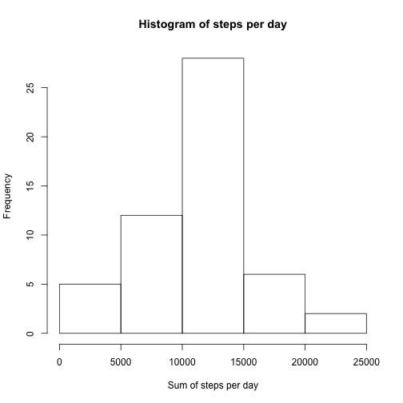
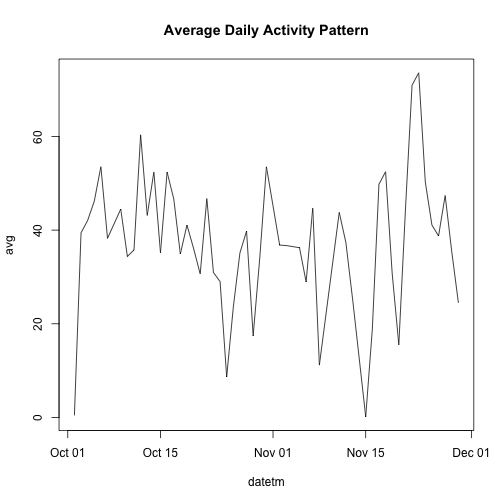
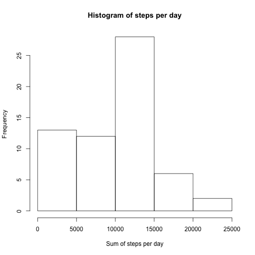
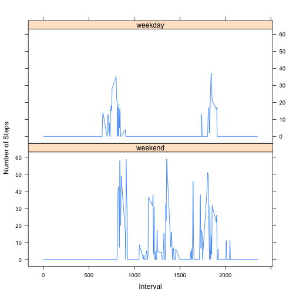

## Loading and preprocessing the data

```r
if(file.exists("activity.zip")){
    unzip("activity.zip")
}

library(data.table)
DT <- fread('activity.csv')
```


## What is mean total number of steps taken per day?

```r
DTClean <- na.omit(DT)
sumSteps <- DTClean[,list(sumSteps=sum(steps)),by=date]

hist(sumSteps$sumSteps, xlab="Sum of steps per day", main="Histogram of steps per day")
```

 

### Mean of total steps taken per day

```r
mean(sumSteps$sumSteps)
```

```
## [1] 10766.19
```

### Median of total steps taken per day

```r
median(sumSteps$sumSteps)
```

```
## [1] 10765
```

## What is the average daily activity pattern?

```r
DTClean$datetm <- as.Date(DTClean$date)
avg <-DTClean[,list(avg=mean(steps)),by=datetm]
plot(avg, type='l', main="Average Daily Activity Pattern")
```

 

## The interval with the maximum average steps over all days is

```r
avg <-DTClean[,list(avg=mean(steps)),by=interval]
avg[which(avg==max(avg)),]$interval
```

```
## [1] 835
```


## Inputing missing values

```r
# number of NA rows
sum(is.na(DT$steps))
```

```
## [1] 2304
```

```r
# fill in missing values with the median steps in the dataset
indx<- which(is.na(DT$steps))
DT[indx]$steps <- median(DT$steps, na.rm=TRUE)

sumSteps <- DT[,list(sumSteps=sum(steps)),by=date]

hist(sumSteps$sumSteps, xlab="Sum of steps per day", main="Histogram of steps per day")
```

 

### Mean of total steps taken per day with NAs replaced

```r
mean(sumSteps$sumSteps)
```

```
## [1] 9354.23
```

### Median of total steps taken per day with NAs replaced

```r
median(sumSteps$sumSteps)
```

```
## [1] 10395
```

## Are there differences in activity patterns between weekdays and weekends?

```r
library(chron)
DT$weekend = factor(chron::is.weekend(DT$date), c(TRUE, FALSE), c('weekend', 'weekday'))

avg<-DT[,list(avgSteps=as.double(median(steps))), by=c("weekend","interval")]

library(lattice)

xyplot(avgSteps~interval|weekend, data = avg, type = "l",
   ylab="Number of Steps", xlab="Interval",
   layout=c(1,2))
```

 

